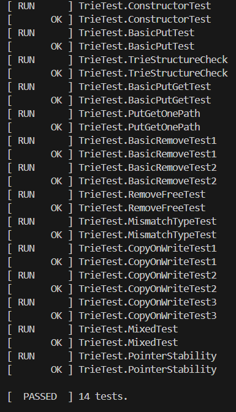
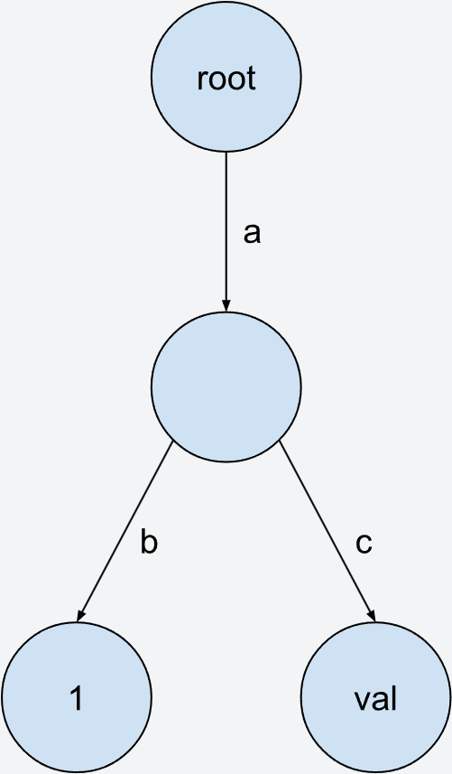
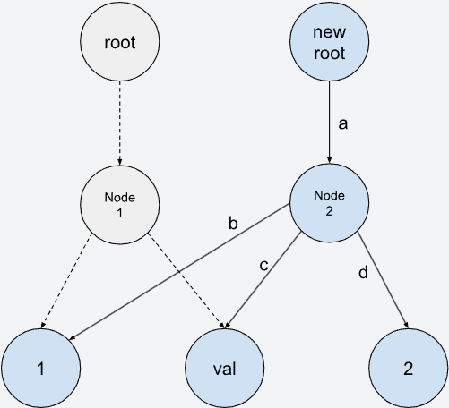
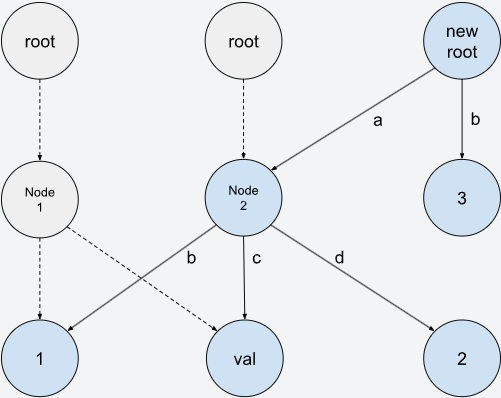
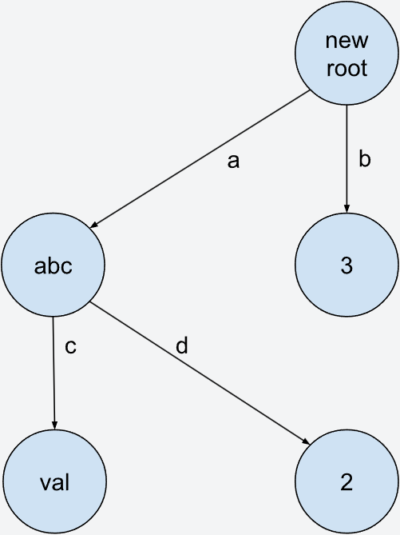

# **Trie树**

### 任务学习目标：

- 模板
- 多态
- trie树
- 智能指针
- std::move

---

### 题目背景：
本次题目不同于以往，这次的题目来源于卡内基梅隆大学一个公开课的课后习题
虽然选取的部分只是这个公开课的第一个课后习题的第一个task，但是其难度不小
因此代码中附带了测试文件，若你无法完成全部的测试用例，可以提交只通过部分测试用例的代码
你只需要修改trie.cpp和trie.h，无需添加main函数，使用CMake编译即可
如果你的代码通过了所有的测试用例，你会看到如下图的输出：

**下面的题目描述均来自于课程网站**

### Project Specification
In this project, you will implement a key-value store backed by a copy-on-write trie. Tries are efficient ordered-tree data structures for retrieving a value for a given key. To simplify the explanation, we will assume that the keys are variable-length strings, but in practice they can be any arbitrary type.

Each node in a trie can have multiple child nodes representing different possible next characters.

The key-value store you will implement can store string keys mapped to values of any type. The value of a key is stored in the node representing the last character of that key (aka terminal node). For example, consider inserting kv pairs ("ab", 1) and ("ac", "val") into the trie.

The two keys share the same parent node. The value 1 corresponding to key "ab" is stored in the left child, and the value "val" corresponding to key "ac" is stored in the right node.
### Task
In this task, you will need to modify trie.h and trie.cpp to implement a copy-on-write trie. In a copy-on-write trie, operations do not directly modify the nodes of the original trie. Instead, new nodes are created for modified data, and a new root is returned for the newly-modified trie. Copy-on-write enables us to access the trie after each operation at any time with minimum overhead. Consider inserting ("ad", 2) in the above example. We create a new Node2 by reusing two of the child nodes from the original tree, and creating a new value node 2. (See figure below)

If we then insert ("b", 3), we will create a new root, a new node and reuse the previous nodes. In this way, we can get the content of the trie before and after each insertion operation. As long as we have the root object (Trie class), we can access the data inside the trie at that time. (See figure below)

One more example: if we then insert ("a", "abc") and remove ("ab", 1), we can get the below trie. Note that parent nodes can have values, and you will need to purge all unnecessary nodes after removal. An empty trie is represented by nullptr.

Your trie must support three operations:

- Get(key): Get the value corresponding to the key.
- Put(key, value): Set the corresponding value to the key. Overwrite existing value if the key already exists. Note that the type of the value might be non-copyable (i.e., std::unique_ptr<int>). This method returns a new trie.
- Delete(key): Delete the value for the key. This method returns a new trie.

None of these operations should be performed directly on the trie itself. You should create new trie nodes and reuse existing ones as much as possible.

To create a completely new node (i.e., a new leaf node without children), you can simply construct the object using the TrieNodeWithValue constructor and then make it into a smart pointer. To copy-on-write create a new node, you should use the Clone function on the TrieNode class. To reuse an existing node in the new trie, you can copy std::shared_ptr<TrieNode>: copying a shared pointer doesn’t copy the underlying data. You should not manually allocate memory by using new and delete in this project. std::shared_ptr will deallocate the object when no one has a reference to the underlying object.

For the full specifications of these operations, please refer to the comments in the starter code. Your implementation should store data as in the above examples. Do not store the C-string terminator \0 in your trie. Please also avoid removing any const from the class definitions or use mutable / const_cast to bypass the const checks.